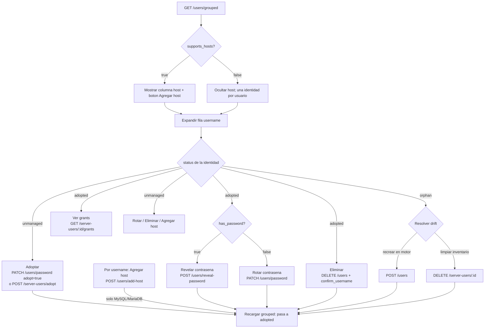

# Gestión de usuarios del motor — Documentación de API para Frontend

> Vista agrupada + CRUD por identidad física de los usuarios de un servidor de base de
> datos gestionado por el gateway. Esta guía está orientada al equipo **frontend**:
> explica **qué cambió**, **por qué**, el **contrato** de cada endpoint y el **flujo**
> recomendado de navegación entre ellos.

---

## Resumen ejecutivo

El gateway ahora expone una forma **agrupada por username** de listar los usuarios de un
servidor, más un conjunto de **6 endpoints nuevos** que operan por la **identidad física**
del usuario (`server_id` + `username` + `host`) directamente sobre el motor de base de
datos — **funcionen o no adoptados** en el inventario del gateway.

Antes, la única forma de gestionar un usuario del motor exigía que estuviera **adoptado**
(registrado en el inventario del gateway) y se operaba por su `id` de inventario. Además,
el listado era **plano**: un `user@host` por cada cuenta, lo que repetía el mismo nombre N
veces y era difícil de leer.

Con la nueva adaptación, el frontend puede:

1. **Leer sin redundancia** — una fila por username, expandible a sus identidades (hosts).
2. **CRUD sin adopción previa** — crear, cambiar contraseña, eliminar y agregar hosts a un
   usuario aunque no esté en el inventario.
3. **Agregar hosts** a un usuario (solo MySQL/MariaDB).
4. **Revelar la contraseña** cuando el gateway la conoce (la fijó él mismo).

Lo anterior (listado plano + inventario por `id`) **sigue existiendo** por compatibilidad;
el frontend debería **migrar a la vista agrupada** para el listado principal.

---

## Envelope y autenticación (común a todo)

- **Envelope de respuesta**: toda respuesta exitosa viene envuelta:
  ```jsonc
  { "data": <payload>, "message": "..." }
  ```
  Los campos `null` se **omiten** del JSON (no llegan como `"campo": null`). Antes de leer
  una propiedad opcional, verifica su presencia.
- **Autenticación**: sesión de **admin** por cookie. Login en `POST /api/v1/auth/login`.
  Sin sesión válida → **401** en cualquier endpoint.
- **Prefijo**: todos los paths cuelgan de `/api/v1`.
- **Modelo de usuario único (single-admin)**: no hay roles ni multi-tenant. Cualquier admin
  autenticado tiene acceso pleno; no hay que ocultar acciones por permisos de usuario.

---

## Antes vs Ahora

### Estado anterior (sigue vigente)

| Endpoint | Forma | Requiere adopción | Nota |
|---|---|---|---|
| `GET /servers/{server_id}/users` | `list[{ username, host }]` **plano** (`host: null` en PostgreSQL) | No (solo lee el motor) | Redundante: repite el username por cada host. **Migrar a la vista agrupada.** |
| `GET /server-users?server_id=` | Paginado (`ServerUserOut`) | — | Inventario del gateway. Contexto vigente. |
| `POST /server-users` (`?provision=bool`) | Crea fila de inventario | Sí | Por `id` de inventario. |
| `POST /server-users/adopt` | Adopta un usuario del motor | — | Registra sin ejecutar DDL. |
| `PATCH /server-users/{user_id}` (`?provision=bool`) | Edita fila | Sí | Solo usuarios adoptados. |
| `DELETE /server-users/{user_id}` (`?drop_remote=bool&confirm_username=`) | Elimina | Sí | Solo usuarios adoptados. |
| `GET/POST/DELETE /server-users/{user_id}/grants` | Grants | Sí | **Por `id` de inventario** → solo adoptados. |
| `POST /server-users/{user_id}/apply-profile/{profile_id}` | Perfil de permisos | Sí | Solo adoptados. |

> **Clave**: los endpoints de inventario operan **por `id`** y solo funcionan con usuarios
> **adoptados**. Los grants siguen viviendo aquí, así que para "ver grants" de una identidad
> necesitas su `server_user_id` (ver flujo).

### Estado nuevo

| Endpoint | Opera por | Adopción | Motores |
|---|---|---|---|
| `GET /servers/{server_id}/users/grouped` | identidad física | lee ambos planos | todos |
| `POST /servers/{server_id}/users` | identidad física | opcional (`adopt`) | todos |
| `PATCH /servers/{server_id}/users/password` | identidad física | opcional (`adopt`) | todos |
| `DELETE /servers/{server_id}/users` | identidad física | sincroniza si existe | todos |
| `POST /servers/{server_id}/users/add-host` | identidad física | opcional (`adopt`) | **solo MySQL/MariaDB** |
| `POST /servers/{server_id}/users/reveal-password` | identidad física | requiere fila de inventario | todos |

Los 5 endpoints de escritura/lectura por identidad operan **directamente sobre el motor**
por `(server_id, username, host)`. **No exigen** que el usuario esté adoptado. Si existe una
fila de inventario que coincide, la **sincronizan**.

---

## Motivo del cambio

En **MySQL / MariaDB** un usuario **no es una entidad única**: `'alice'@'localhost'` y
`'alice'@'%'` son **cuentas separadas**, cada una con su propia contraseña y sus propios
grants. El listado plano devolvía un `user@host` por cuenta, así que un mismo nombre
aparecía repetido N veces → difícil de leer y de razonar.

En **PostgreSQL** un ROLE **no tiene host** (el acceso por host se controla en
`pg_hba.conf`, fuera del alcance SQL). Un usuario = un rol.

### Asimetría por motor (el frontend DEBE respetarla)

| Concepto | MySQL / MariaDB | PostgreSQL |
|---|---|---|
| Identidad de usuario | `'user'@'host'` (varias por nombre) | un ROLE (una por nombre) |
| `supports_hosts` (en la respuesta) | `true` | `false` |
| Columna "host" en la UI | mostrar | **ocultar** |
| Botón "Agregar host" | mostrar | **ocultar** (endpoint da 422) |
| Contraseña | hash por cuenta | hash por rol |

La respuesta agrupada trae `supports_hosts`. **Léelo y adapta la UI**: si es `false`, oculta
la columna host y el botón "Agregar host"; cada usuario tendrá una sola identidad con
`host: null`.

La nueva adaptación logra: **(1)** agrupar por username para leer sin redundancia,
**(2)** permitir CRUD del usuario esté o no adoptado, **(3)** permitir agregar hosts a un
usuario (MySQL/MariaDB) y **(4)** revelar la contraseña cuando el gateway la conoce.

---

## Referencia de endpoints

### 1. Listar usuarios agrupados

```
GET /api/v1/servers/{server_id}/users/grouped
```

**Qué hace**: cruza el **plano en vivo** (motor real) con el **inventario** del gateway y
agrupa por username. Es la vista principal de la pantalla de usuarios.

**Autenticación**: requerida (sesión admin).

**Respuesta 200** — `GroupedEngineUsersOut`:

```jsonc
{
  "data": {
    "dialect": "mysql",
    "supports_hosts": true,
    "users": [
      {
        "username": "alice",
        "identity_count": 3,
        "identities": [
          { "host": "localhost", "status": "adopted",   "server_user_id": 12,
            "has_password": true,  "is_active": true, "notes": null },
          { "host": "%",         "status": "unmanaged", "server_user_id": null,
            "has_password": false, "is_active": null, "notes": null },
          { "host": "10.0.0.5",  "status": "orphan",    "server_user_id": 33,
            "has_password": true,  "is_active": true, "notes": "temporal" }
        ]
      }
    ]
  },
  "message": "..."
}
```

**Estados de cada identidad** (`status`):

| Valor | Significado | Origen |
|---|---|---|
| `adopted` | en el inventario del gateway (gestionada) | motor **y** inventario |
| `unmanaged` | solo en el motor (adoptable) | solo motor |
| `orphan` | solo en el inventario, borrada por fuera del gateway → **drift** | solo inventario |

**PostgreSQL**: `supports_hosts: false`; cada usuario tiene **una sola** identidad con
`host: null`.

**Campos por identidad**:

- `host` — `string` en MySQL/MariaDB; `null` en PostgreSQL.
- `status` — `enum`: `adopted | unmanaged | orphan`.
- `server_user_id` — `number | null`. Presente si `status != unmanaged`. **Es la llave**
  para navegar a los grants (`/server-users/{id}/grants`).
- `has_password` — `boolean`. `true` si el gateway conoce la contraseña (→ se puede
  **revelar**). Úsalo para habilitar/deshabilitar el botón "Revelar contraseña".
- `is_active` — `boolean | null` (null si no está en inventario).
- `notes` — `string | null`.

---

### 2. Crear usuario en el motor

```
POST /api/v1/servers/{server_id}/users
```

**Qué hace**: ejecuta `CREATE USER` en el motor. Con `adopt=true` además registra el usuario
en el inventario guardando la contraseña **cifrada** (habilita revelarla luego).

**Body** — `EngineUserCreateIn`:

```jsonc
{
  "username": "alice",     // requerido; whitelist ^[A-Za-z_][A-Za-z0-9_]{0,62}$
  "host": "%",             // opcional, default "%"; ignorado/irrelevante en PostgreSQL
  "password": "s3cr3t",    // requerido
  "adopt": false,          // opcional, default false
  "notes": null            // opcional
}
```

**Respuesta 201**:

```jsonc
{ "data": { "username": "alice", "host": "%", "adopted": true, "server_user_id": 40 },
  "message": "..." }
```

- `adopted` — `boolean`: si quedó registrado en el inventario.
- `server_user_id` — `number | null`: presente si `adopted: true`.

**Estados**: 201 creado · 401 sin sesión · 404 servidor inexistente · 409 credencial
pseudo-root · 422 validación (username/host inválidos).

---

### 3. Cambiar contraseña

```
PATCH /api/v1/servers/{server_id}/users/password
```

**Qué hace**: ejecuta `ALTER USER/ROLE` en el motor para cambiar la contraseña. Si ya hay
fila de inventario, la **sincroniza** (la contraseña queda **revelable**). El flag `adopt`
solo aplica si **no** había fila previa.

**Body** — `EnginePasswordChangeIn`:

```jsonc
{
  "username": "alice",         // requerido
  "host": "%",                 // opcional, default "%"
  "new_password": "n3w-p4ss",  // requerido
  "adopt": false               // opcional; solo aplica si NO existe fila de inventario
}
```

**Respuesta 200**:

```jsonc
{ "data": { "username": "alice", "host": "%", "adopted": true, "server_user_id": 40 },
  "message": "..." }
```

**Estados**: 200 · 401 · 404 servidor/usuario inexistente · 409 credencial pseudo-root ·
422 validación.

> **Nota UX**: tras rotar la contraseña por el gateway, esa identidad pasa a
> `has_password: true` → el botón "Revelar contraseña" se habilita. Recarga la vista
> agrupada o actualiza el estado local de esa identidad.

---

### 4. Eliminar usuario (DROP)

```
DELETE /api/v1/servers/{server_id}/users?username=&host=%&confirm_username=
```

**Qué hace**: ejecuta `DROP USER/ROLE` en el motor y, si hay fila de inventario, la elimina.
Operación **destructiva e irreversible**.

**Query params**:

- `username` — requerido.
- `host` — opcional, default `%` (irrelevante en PostgreSQL).
- `confirm_username` — requerido; **debe repetir exactamente** el `username` (doble
  intención). Si no coincide → **422**.

**Respuesta 200**:

```jsonc
{ "data": null, "message": "Usuario eliminado" }
```

**Estados**: 200 · 401 · 404 servidor/usuario inexistente · 409 el usuario **posee BDs
gestionadas** (reasignar/eliminar esas BDs primero) o es la credencial pseudo-root · 422
`confirm_username` incorrecto.

> **UX obligatoria**: modal de confirmación con **advertencia de irreversibilidad** y campo
> donde el admin **escriba el username exacto**. Deshabilita el botón "Confirmar" hasta que
> el texto coincida (así evitas el 422). Muestra un estado "operación en curso" bloqueante.

---

### 5. Agregar host (clonar cuenta a un nuevo host)

```
POST /api/v1/servers/{server_id}/users/add-host
```

**Qué hace**: clona una cuenta existente (`'user'@'source_host'`) a un **nuevo host**
(`'user'@'new_host'`) mediante `CREATE USER`. **Solo MySQL/MariaDB** → en PostgreSQL da
**422**.

**Body** — `AddHostIn`:

```jsonc
{
  "username": "alice",       // requerido
  "source_host": "%",        // opcional, default "%": cuenta origen desde la que se clona
  "new_host": "10.0.0.5",    // requerido: nuevo host
  "reuse_password": true,    // opcional, default true
  "new_password": null,      // requerido SOLO si reuse_password=false; si falta → 422
  "copy_grants": false,      // opcional: replica los permisos del origen (best-effort)
  "adopt": false,            // opcional: registra la nueva identidad en el inventario
  "notes": null              // opcional
}
```

- `reuse_password: true` — copia el **hash** de la cuenta origen (misma contraseña, el
  gateway **no la descubre** en claro).
- `reuse_password: false` — exige `new_password` (si falta → **422**).
- `copy_grants: true` — replica los permisos del origen; **best-effort**: un fallo no
  revierte la creación del host, se reporta en `grants_error`.

**Respuesta 201**:

```jsonc
{
  "data": {
    "username": "alice",
    "new_host": "10.0.0.5",
    "password_mode": "reused",     // "reused" | "new"
    "grants_copied": 0,            // number: cuántas sentencias GRANT se replicaron
    "grants_error": null,          // string si copy_grants=true falló parcialmente
    "adopted": false,
    "server_user_id": null
  },
  "message": "..."
}
```

**Estados**: 201 · 401 · 404 servidor/cuenta origen inexistente · 409 credencial
pseudo-root · 422 en PostgreSQL, o `reuse_password=false` sin `new_password`, o
username/host inválidos.

> **Advertencia a mostrar si `copy_grants=true`**: se replican fielmente privilegios
> **globales** (`ALL ON *.*`, `SUPER`, …) y `WITH GRANT OPTION` del origen. Es la semántica
> esperada de "clonar la cuenta", pero conviene avisar del riesgo de sobre-aprovisionamiento.
> Si `grants_error` viene con contenido, muéstralo: el host se creó pero **algún grant no se
> copió**.

---

### 6. Revelar contraseña

```
POST /api/v1/servers/{server_id}/users/reveal-password
```

**Qué hace**: devuelve la contraseña **en claro** de una identidad, **solo** cuando el
gateway la conoce. Acción **auditada**.

**Body** — `EngineRevealPasswordIn`:

```jsonc
{ "username": "alice", "host": "%" }
```

**Respuesta 200**:

```jsonc
{ "data": { "username": "alice", "host": "%", "password": "s3cr3t" }, "message": "..." }
```

**Límite criptográfico (documentarlo bien en la UI)**:

- El **motor** solo guarda un **hash irreversible**: una contraseña que el gateway **nunca
  conoció** es **irrecuperable**.
- El **gateway** solo puede revelar una contraseña que **él mismo fijó** (create o rotación
  vía gateway) y guarda cifrada.

Por eso:

| Situación | Código | Mensaje sugerido en UI |
|---|---|---|
| Usuario **no** en el inventario | **404** | "Adopta o gestiona este usuario por el gateway primero." |
| Adoptado, pero el gateway **no** conoce su contraseña | **409** | "Solo se puede **rotar** la contraseña, no revelarla (el gateway nunca la fijó)." |
| Contraseña fijada por el gateway | **200** | Devuelve la contraseña. |

> **UX**: habilita "Revelar contraseña" solo si `has_password: true` en la vista agrupada.
> Aun así, maneja el 409/404 por si el estado local está desactualizado. Trata la contraseña
> como secreto efímero (no la persistas en el cliente, ofrécela para copiar y ocúltala).

---

## Semántica de errores

Los errores controlados llegan como payload de `AppHttpException`: incluyen `message` y
`request_id` (y `context` solo en desarrollo). **Muestra el `request_id`** en la UI de error
para soporte/trazabilidad.

```jsonc
{ "message": "El usuario posee bases de datos gestionadas", "request_id": "a1b2c3d4e5f6a7b8" }
```

| Código | Causa | Dónde aplica |
|---|---|---|
| **401** | Sin sesión admin. | Todos. |
| **404** | Servidor o usuario inexistente. | Todos (reveal: usuario no en inventario). |
| **409** | Operación sobre la credencial **pseudo-root** del gateway (guard anti auto-lockout); **o** eliminar un usuario que **posee BDs gestionadas**; **o** reveal de un usuario adoptado cuya contraseña el gateway no conoce. | create / password / delete / add-host / reveal. |
| **422** | Validación: `username`/`host` fuera de la whitelist; `add-host` en PostgreSQL; DELETE con `confirm_username` incorrecto; `add-host` con `reuse_password=false` sin `new_password`. | Según endpoint. |

**Whitelist estricta** (valida en el cliente antes de enviar para evitar 422):

- `username`: `^[A-Za-z_][A-Za-z0-9_]{0,62}$`
- `host`: `^[A-Za-z0-9_.%:\-]{1,255}$`

> **Guard pseudo-root (409)**: el gateway administra cada servidor con una credencial
> pseudo-root. Crear/rotar/dropear/agregar-host sobre **ese** username devuelve 409 para
> evitar que el gateway se quede sin control del servidor. El frontend no siempre sabe cuál
> es ese username; basta con manejar el 409 y mostrar el `message`.

---

## Flujo entre endpoints

### Happy path (narrativa)

1. **Cargar** `GET /users/grouped` → render **master-detail**: una fila por username,
   expandible a sus identidades.
2. Lee `supports_hosts` una vez → decide si muestras la columna host y el botón "Agregar
   host".
3. **Por identidad** (fila expandida): según `status` y `has_password`, ofrece revelar /
   rotar / eliminar / ver grants.
4. **Por username**: "Agregar host" (solo si `supports_hosts`).
5. Tras cualquier escritura, **recarga la vista agrupada** (o actualiza el estado local de la
   identidad afectada) para reflejar cambios de `status` / `has_password`.

### Acciones según estado de la identidad

| `status` | Qué ofrecer | Endpoints |
|---|---|---|
| `adopted` | Revelar (si `has_password`) · Rotar contraseña · Eliminar · **Ver grants** (`server_user_id`) | reveal / password / delete / `/server-users/{id}/grants` |
| `unmanaged` | **Adoptar** (rotar/crear con `adopt=true`, o `POST /server-users/adopt`) · Rotar · Eliminar · Agregar host | password (`adopt=true`) / add-host / delete |
| `orphan` | **Resolver drift**: la fila de inventario existe pero el usuario ya no está en el motor → recrearlo (create) o limpiar la fila huérfana (`DELETE /server-users/{id}`) | create / `DELETE /server-users/{id}` |

> **Ver grants**: los grants viven en el inventario (`/server-users/{id}/grants`), que opera
> por `server_user_id`. Solo disponible si `status != unmanaged` (es decir, si hay
> `server_user_id`). Para ver grants de un `unmanaged`, adóptalo primero.

### Diagrama de flujo



---

## Notas de implementación para el frontend

- **`supports_hosts`** — bandera maestra de la asimetría por motor. Si es `false`
  (PostgreSQL): oculta la columna host, el selector de host en formularios y el botón
  "Agregar host". Cada usuario tendrá una identidad con `host: null`.
- **`has_password`** — habilita/deshabilita "Revelar contraseña". Aun con `true`, maneja
  404/409 por estado desactualizado.
- **`server_user_id`** — llave para enlazar una identidad con sus **grants**
  (`/server-users/{id}/grants`) y demás endpoints de inventario. Solo presente si
  `status != unmanaged`. Si es `null`, oculta o deshabilita "Ver grants".
- **`status`** — dirige el menú de acciones (ver tabla del flujo). Resalta visualmente los
  `orphan` como **drift** que requiere resolución.
- **Validación en cliente** — aplica las whitelists de `username`/`host` antes de enviar
  para evitar 422 y dar feedback inmediato.
- **Operaciones destructivas / irreversibles** (DELETE, y en menor medida DROP implícito):
  - Modal de confirmación con **advertencia explícita de irreversibilidad**.
  - Campo para **escribir el username exacto** (espeja `confirm_username`); botón de
    confirmar deshabilitado hasta que coincida.
  - Estado **"operación en curso"** bloqueante (deshabilitar controles, spinner) mientras el
    motor responde.
- **`add-host` con `copy_grants`** — advierte del sobre-aprovisionamiento (se clonan
  privilegios globales y `WITH GRANT OPTION`). Si la respuesta trae `grants_error`, el host
  se creó pero algún grant no se copió: muéstralo como advertencia, no como fallo total.
- **Revelar contraseña** — secreto efímero: no lo persistas en el cliente; ofrécelo para
  copiar y luego ocúltalo. La acción se audita en backend.
- **Manejo de errores** — muestra `message` y el `request_id` del payload de error para
  soporte. Distingue 4xx (acción del usuario, recuperable) de 5xx (`{ "message": "Internal
  Server Error", "request_id": "..." }`, reintentable/soporte).
- **Refresco tras escritura** — recarga `GET /users/grouped` o actualiza localmente la
  identidad afectada; muchos cambios alteran `status` (`unmanaged → adopted`) o
  `has_password` (`false → true`).
- **Paginación** — `GET /users/grouped` devuelve el conjunto agrupado del servidor (no
  paginado). Si un servidor tuviera muchísimos usuarios, considera filtrado/búsqueda en
  cliente. El inventario (`GET /server-users`) sí es paginado (`?page=&size=`, offset).
- **Permisos** — single-admin: no hay que ocultar acciones por rol de usuario; todo admin
  autenticado puede ejecutarlas.

---

## Referencias

- Doc técnica de la feature: `docs/features/engine-users-management.md`.
- Módulo de adopción/reconciliación: `docs/features/adoption-reconcile-snapshot.md`.
- Grants y perfiles de permisos: endpoints `/server-users/{id}/grants` y
  `/server-users/{id}/apply-profile/{profile_id}`.
