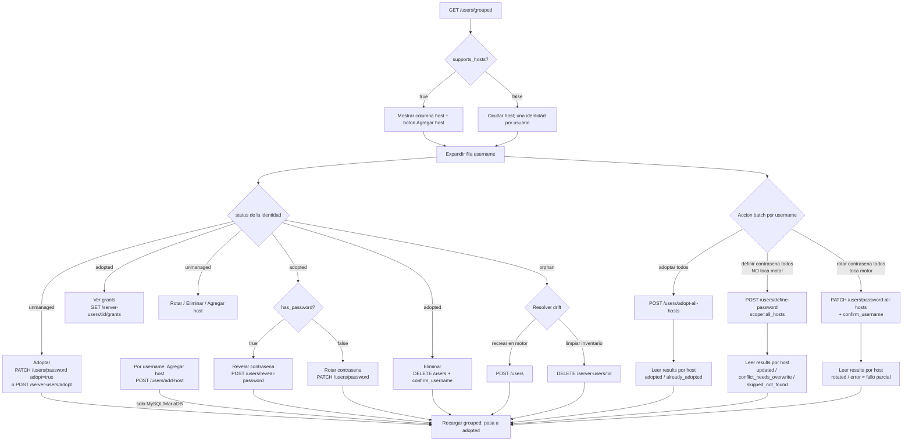

# Gestión de usuarios del motor — Documentación de API para Frontend

> Vista agrupada + CRUD por identidad física de los usuarios de un servidor de base de
> datos gestionado por el gateway. Esta guía está orientada al equipo **frontend**:
> explica **qué cambió**, **por qué**, el **contrato** de cada endpoint y el **flujo**
> recomendado de navegación entre ellos.

---

## Resumen ejecutivo

El gateway ahora expone una forma **agrupada por username** de listar los usuarios de un
servidor, más un conjunto de endpoints que operan por la **identidad física** del usuario
(`server_id` + `username` + `host`) directamente sobre el motor de base de datos —
**funcionen o no adoptados** en el inventario del gateway. A la primera tanda de **6
endpoints por identidad** se le suman ahora **3 endpoints batch** que actúan sobre el
**username completo** (todos sus hosts) de una sola vez.

Antes, la única forma de gestionar un usuario del motor exigía que estuviera **adoptado**
(registrado en el inventario del gateway) y se operaba por su `id` de inventario. Además,
el listado era **plano**: un `user@host` por cada cuenta, lo que repetía el mismo nombre N
veces y era difícil de leer.

Con la nueva adaptación, el frontend puede:

1. **Leer sin redundancia** — una fila por username, expandible a sus identidades (hosts).
2. **CRUD sin adopción previa** — crear, cambiar contraseña, eliminar y agregar hosts a un
   usuario aunque no esté en el inventario.
3. **Agregar hosts** a un usuario (solo MySQL/MariaDB).
4. **Revelar la contraseña** cuando el gateway la conoce (la fijó él mismo).

### Ampliación (operaciones por username completo — batch)

A los 6 endpoints por identidad se suman **3 endpoints nuevos** que operan sobre el
**username completo** (todas sus identidades/hosts) en una sola llamada, sin necesidad de
iterar host por host desde el cliente:

5. **Adoptar todos los hosts** de un username de una sola vez (`adopt-all-hosts`), en vez de
   llamar `POST /server-users/adopt` una vez por host.
6. **Definir una contraseña ya conocida** por el admin (`define-password`) — el gateway la
   **cifra y recuerda** para poder revelarla luego, **sin** ejecutar `ALTER USER` (no toca
   el motor). Es una acción **distinta** de "cambiar/rotar" la contraseña real.
7. **Rotar la contraseña real en todos los hosts** (`password-all-hosts`) — ejecuta
   `ALTER USER/ROLE` con alcance **global** sobre cada cuenta del username.

**Ninguna tabla nueva**: `ServerUser` sigue siendo **una fila por identidad física**
`(server_id, username, host)`. Los endpoints batch resuelven todo iterando sobre el plano
en vivo del motor (`adapter.list_users()`) y las filas de inventario existentes.

Lo anterior (listado plano + inventario por `id`) **sigue existiendo** por compatibilidad;
el frontend debería **migrar a la vista agrupada** para el listado principal.

---

## Envelope y autenticación (común a todo)

- **Envelope de respuesta**: toda respuesta exitosa viene envuelta:
  ```jsonc
  { "data": <payload>, "message": "..." }
  ```
  Los campos `null` se **omiten** del JSON (no llegan como `"campo": null`). Antes de leer
  una propiedad opcional, verifica su presencia.
- **Autenticación**: sesión de **admin** por cookie. Login en `POST /api/v1/auth/login`.
  Sin sesión válida → **401** en cualquier endpoint.
- **Prefijo**: todos los paths cuelgan de `/api/v1`.
- **Modelo de usuario único (single-admin)**: no hay roles ni multi-tenant. Cualquier admin
  autenticado tiene acceso pleno; no hay que ocultar acciones por permisos de usuario.

---

## Antes vs Ahora

### Estado anterior (sigue vigente)

| Endpoint | Forma | Requiere adopción | Nota |
|---|---|---|---|
| `GET /servers/{server_id}/users` | `list[{ username, host }]` **plano** (`host: null` en PostgreSQL) | No (solo lee el motor) | Redundante: repite el username por cada host. **Migrar a la vista agrupada.** |
| `GET /server-users?server_id=` | Paginado (`ServerUserOut`) | — | Inventario del gateway. Contexto vigente. |
| `POST /server-users` (`?provision=bool`) | Crea fila de inventario | Sí | Por `id` de inventario. |
| `POST /server-users/adopt` | Adopta un usuario del motor | — | Registra sin ejecutar DDL. |
| `PATCH /server-users/{user_id}` (`?provision=bool`) | Edita fila | Sí | Solo usuarios adoptados. |
| `DELETE /server-users/{user_id}` (`?drop_remote=bool&confirm_username=`) | Elimina | Sí | Solo usuarios adoptados. |
| `GET/POST/DELETE /server-users/{user_id}/grants` | Grants | Sí | **Por `id` de inventario** → solo adoptados. |
| `POST /server-users/{user_id}/apply-profile/{profile_id}` | Perfil de permisos | Sí | Solo adoptados. |

> **Clave**: los endpoints de inventario operan **por `id`** y solo funcionan con usuarios
> **adoptados**. Los grants siguen viviendo aquí, así que para "ver grants" de una identidad
> necesitas su `server_user_id` (ver flujo).

### Estado nuevo

| Endpoint | Opera por | Adopción | Motores |
|---|---|---|---|
| `GET /servers/{server_id}/users/grouped` | identidad física | lee ambos planos | todos |
| `POST /servers/{server_id}/users` | identidad física | opcional (`adopt`) | todos |
| `PATCH /servers/{server_id}/users/password` | identidad física | opcional (`adopt`) | todos |
| `DELETE /servers/{server_id}/users` | identidad física | sincroniza si existe | todos |
| `POST /servers/{server_id}/users/add-host` | identidad física | opcional (`adopt`) | **solo MySQL/MariaDB** |
| `POST /servers/{server_id}/users/reveal-password` | identidad física | requiere fila de inventario | todos |
| `POST /servers/{server_id}/users/adopt-all-hosts` | **username completo** (todos los hosts) | adopta cada host en vivo | todos |
| `POST /servers/{server_id}/users/define-password` | username (`scope: host \| all_hosts`) | opcional (`adopt_if_missing`); **no toca el motor** | todos |
| `PATCH /servers/{server_id}/users/password-all-hosts` | **username completo** (todos los hosts) | opcional (`adopt_if_missing`) | todos |

Los 5 endpoints de escritura/lectura por identidad operan **directamente sobre el motor**
por `(server_id, username, host)`. **No exigen** que el usuario esté adoptado. Si existe una
fila de inventario que coincide, la **sincronizan**.

Los **3 endpoints batch** operan sobre el **username completo**: iteran sobre todas las
identidades (hosts) en vivo del motor y devuelven un arreglo `results` con el desenlace
**por host**. Son **fail-tolerant** (un host que falla no aborta el resto), salvo
`define-password`, que nunca toca el motor y por tanto no puede "fallar por host". No
sustituyen a sus equivalentes por identidad: conviven.

---

## Motivo del cambio

En **MySQL / MariaDB** un usuario **no es una entidad única**: `'alice'@'localhost'` y
`'alice'@'%'` son **cuentas separadas**, cada una con su propia contraseña y sus propios
grants. El listado plano devolvía un `user@host` por cuenta, así que un mismo nombre
aparecía repetido N veces → difícil de leer y de razonar.

En **PostgreSQL** un ROLE **no tiene host** (el acceso por host se controla en
`pg_hba.conf`, fuera del alcance SQL). Un usuario = un rol.

### Asimetría por motor (el frontend DEBE respetarla)

| Concepto | MySQL / MariaDB | PostgreSQL |
|---|---|---|
| Identidad de usuario | `'user'@'host'` (varias por nombre) | un ROLE (una por nombre) |
| `supports_hosts` (en la respuesta) | `true` | `false` |
| Columna "host" en la UI | mostrar | **ocultar** |
| Botón "Agregar host" | mostrar | **ocultar** (endpoint da 422) |
| Contraseña | hash por cuenta | hash por rol |

La respuesta agrupada trae `supports_hosts`. **Léelo y adapta la UI**: si es `false`, oculta
la columna host y el botón "Agregar host"; cada usuario tendrá una sola identidad con
`host: null`.

La nueva adaptación logra: **(1)** agrupar por username para leer sin redundancia,
**(2)** permitir CRUD del usuario esté o no adoptado, **(3)** permitir agregar hosts a un
usuario (MySQL/MariaDB) y **(4)** revelar la contraseña cuando el gateway la conoce.

### Por qué los endpoints batch (por username completo)

Como en MySQL/MariaDB cada host es una **cuenta separada**, gestionar "el usuario alice"
como concepto humano obligaba antes a **repetir la misma operación host por host** desde el
cliente: adoptar `alice@localhost`, luego `alice@%`, luego `alice@10.0.0.5`… El admin
razona en términos de "el usuario alice", no de "cada una de sus cuentas". Los endpoints
batch cierran esa brecha: **una intención del admin = una llamada**, y el gateway hace la
iteración por dentro. **No hay sintaxis nativa del motor** para "todos los hosts a la vez";
el gateway la simula iterando sobre el plano en vivo.

### Distinción clave 1: **DEFINIR** contraseña vs. **ROTAR/CAMBIAR** contraseña

Esto es lo más importante que el frontend debe entender para **no mezclar ambas acciones en
un mismo flujo/modal**. Son operaciones **conceptualmente distintas**:

| | **Definir** (`define-password`) | **Rotar / Cambiar** (`password` y `password-all-hosts`) |
|---|---|---|
| ¿Toca el motor? | **No** — nunca ejecuta `ALTER USER/ROLE` | **Sí** — ejecuta `ALTER USER/ROLE` |
| ¿Qué hace? | Solo **cifra y guarda** en el inventario del gateway la contraseña que el admin **ya conoce** | **Cambia la contraseña real** vigente en el motor |
| ¿Para qué sirve? | Habilitar `reveal-password` de una cuenta cuya contraseña el admin conoce pero el gateway nunca fijó | Establecer una **nueva** contraseña (la anterior deja de servir) |
| Riesgo | El gateway **no puede verificar** que la contraseña sea la real (ver aviso ⚠️) | Ninguna verificación necesaria: la contraseña real pasa a ser la enviada |

**El problema que resuelve `define-password`**: antes, la única forma de que el gateway
"recordara" una contraseña sin tocar el motor era **adoptar sin contraseña** — la cuenta
quedaba `has_password: false` para **siempre**, sin manera de rellenarla salvo **rotándola
de verdad** (cambiando la contraseña real, lo que puede romper apps que ya usan la actual).
`define-password` permite rellenar ese hueco: el admin humano **sabe** cuál es la contraseña
vigente y se la "dicta" al gateway, que la cifra y la guarda **sin alterar el motor**. A
partir de ahí, esa identidad pasa a `has_password: true` y es **revelable**.

> ⚠️ **Aviso obligatorio en la UI de "Definir"**: como el gateway **no toca el motor**, **no
> puede comprobar** que la contraseña dictada coincida con la real. Si el admin la escribe
> mal, `reveal-password` devolverá luego ese valor **incorrecto** sin que nadie lo detecte.
> Es responsabilidad del admin. La UI debe advertirlo explícitamente (p. ej. "El gateway
> guardará esta contraseña tal cual la escribas; no la valida contra el motor").

### Distinción clave 2: alcance **individual** (un host) vs. **global** (todos los hosts)

Casi todas las operaciones existen en **dos alcances**:

- **Individual** — una sola identidad `(username, host)`. Endpoints existentes:
  `POST /users`, `PATCH /users/password`, `DELETE /users`, `reveal-password`.
- **Global** — todos los hosts en vivo del username de una vez. Endpoints nuevos:
  `adopt-all-hosts`, `define-password` con `scope="all_hosts"`, `password-all-hosts`.

> 🚫 **Trampa a evitar en la UI**: el alcance **NUNCA** debe inferirse del valor del campo
> `host`. En MySQL, `"%"` **es un host real** (comodín de conexión), **no** significa "todos
> los hosts". Por eso el alcance es **explícito**: un toggle "Este host / Todos los hosts", o
> el campo `scope` en `define-password`. Enviar `host: "%"` afecta **solo** a la cuenta
> `alice@%`, no a `alice@localhost`.

---

## Referencia de endpoints

### 1. Listar usuarios agrupados

```
GET /api/v1/servers/{server_id}/users/grouped
```

**Qué hace**: cruza el **plano en vivo** (motor real) con el **inventario** del gateway y
agrupa por username. Es la vista principal de la pantalla de usuarios.

**Autenticación**: requerida (sesión admin).

**Respuesta 200** — `GroupedEngineUsersOut`:

```jsonc
{
  "data": {
    "dialect": "mysql",
    "supports_hosts": true,
    "users": [
      {
        "username": "alice",
        "identity_count": 3,
        "identities": [
          { "host": "localhost", "status": "adopted",   "server_user_id": 12,
            "has_password": true,  "is_active": true, "notes": null },
          { "host": "%",         "status": "unmanaged", "server_user_id": null,
            "has_password": false, "is_active": null, "notes": null },
          { "host": "10.0.0.5",  "status": "orphan",    "server_user_id": 33,
            "has_password": true,  "is_active": true, "notes": "temporal" }
        ]
      }
    ]
  },
  "message": "..."
}
```

**Estados de cada identidad** (`status`):

| Valor | Significado | Origen |
|---|---|---|
| `adopted` | en el inventario del gateway (gestionada) | motor **y** inventario |
| `unmanaged` | solo en el motor (adoptable) | solo motor |
| `orphan` | solo en el inventario, borrada por fuera del gateway → **drift** | solo inventario |

**PostgreSQL**: `supports_hosts: false`; cada usuario tiene **una sola** identidad con
`host: null`.

**Campos por identidad**:

- `host` — `string` en MySQL/MariaDB; `null` en PostgreSQL.
- `status` — `enum`: `adopted | unmanaged | orphan`.
- `server_user_id` — `number | null`. Presente si `status != unmanaged`. **Es la llave**
  para navegar a los grants (`/server-users/{id}/grants`).
- `has_password` — `boolean`. `true` si el gateway conoce la contraseña (→ se puede
  **revelar**). Úsalo para habilitar/deshabilitar el botón "Revelar contraseña".
- `is_active` — `boolean | null` (null si no está en inventario).
- `notes` — `string | null`.

---

### 2. Crear usuario en el motor

```
POST /api/v1/servers/{server_id}/users
```

**Qué hace**: ejecuta `CREATE USER` en el motor. Con `adopt=true` además registra el usuario
en el inventario guardando la contraseña **cifrada** (habilita revelarla luego).

**Body** — `EngineUserCreateIn`:

```jsonc
{
  "username": "alice",     // requerido; whitelist ^[A-Za-z_][A-Za-z0-9_]{0,62}$
  "host": "%",             // opcional, default "%"; ignorado/irrelevante en PostgreSQL
  "password": "s3cr3t",    // requerido
  "adopt": false,          // opcional, default false
  "notes": null            // opcional
}
```

**Respuesta 201**:

```jsonc
{ "data": { "username": "alice", "host": "%", "adopted": true, "server_user_id": 40 },
  "message": "..." }
```

- `adopted` — `boolean`: si quedó registrado en el inventario.
- `server_user_id` — `number | null`: presente si `adopted: true`.

**Estados**: 201 creado · 401 sin sesión · 404 servidor inexistente · 409 credencial
pseudo-root · 422 validación (username/host inválidos).

---

### 3. Cambiar contraseña

```
PATCH /api/v1/servers/{server_id}/users/password
```

**Qué hace**: ejecuta `ALTER USER/ROLE` en el motor para cambiar la contraseña. Si ya hay
fila de inventario, la **sincroniza** (la contraseña queda **revelable**). El flag `adopt`
solo aplica si **no** había fila previa.

**Body** — `EnginePasswordChangeIn`:

```jsonc
{
  "username": "alice",         // requerido
  "host": "%",                 // opcional, default "%"
  "new_password": "n3w-p4ss",  // requerido
  "adopt": false               // opcional; solo aplica si NO existe fila de inventario
}
```

**Respuesta 200**:

```jsonc
{ "data": { "username": "alice", "host": "%", "adopted": true, "server_user_id": 40 },
  "message": "..." }
```

**Estados**: 200 · 401 · 404 servidor/usuario inexistente · 409 credencial pseudo-root ·
422 validación.

> **Nota UX**: tras rotar la contraseña por el gateway, esa identidad pasa a
> `has_password: true` → el botón "Revelar contraseña" se habilita. Recarga la vista
> agrupada o actualiza el estado local de esa identidad.

---

### 4. Eliminar usuario (DROP)

```
DELETE /api/v1/servers/{server_id}/users?username=&host=%&confirm_username=
```

**Qué hace**: ejecuta `DROP USER/ROLE` en el motor y, si hay fila de inventario, la elimina.
Operación **destructiva e irreversible**.

**Query params**:

- `username` — requerido.
- `host` — opcional, default `%` (irrelevante en PostgreSQL).
- `confirm_username` — requerido; **debe repetir exactamente** el `username` (doble
  intención). Si no coincide → **422**.

**Respuesta 200**:

```jsonc
{ "data": null, "message": "Usuario eliminado" }
```

**Estados**: 200 · 401 · 404 servidor/usuario inexistente · 409 el usuario **posee BDs
gestionadas** (reasignar/eliminar esas BDs primero) o es la credencial pseudo-root · 422
`confirm_username` incorrecto.

> **UX obligatoria**: modal de confirmación con **advertencia de irreversibilidad** y campo
> donde el admin **escriba el username exacto**. Deshabilita el botón "Confirmar" hasta que
> el texto coincida (así evitas el 422). Muestra un estado "operación en curso" bloqueante.

---

### 5. Agregar host (clonar cuenta a un nuevo host)

```
POST /api/v1/servers/{server_id}/users/add-host
```

**Qué hace**: clona una cuenta existente (`'user'@'source_host'`) a un **nuevo host**
(`'user'@'new_host'`) mediante `CREATE USER`. **Solo MySQL/MariaDB** → en PostgreSQL da
**422**.

**Body** — `AddHostIn`:

```jsonc
{
  "username": "alice",       // requerido
  "source_host": "%",        // opcional, default "%": cuenta origen desde la que se clona
  "new_host": "10.0.0.5",    // requerido: nuevo host
  "reuse_password": true,    // opcional, default true
  "new_password": null,      // requerido SOLO si reuse_password=false; si falta → 422
  "copy_grants": false,      // opcional: replica los permisos del origen (best-effort)
  "adopt": false,            // opcional: registra la nueva identidad en el inventario
  "notes": null              // opcional
}
```

- `reuse_password: true` — copia el **hash** de la cuenta origen (misma contraseña, el
  gateway **no la descubre** en claro).
- `reuse_password: false` — exige `new_password` (si falta → **422**).
- `copy_grants: true` — replica los permisos del origen; **best-effort**: un fallo no
  revierte la creación del host, se reporta en `grants_error`.

**Respuesta 201**:

```jsonc
{
  "data": {
    "username": "alice",
    "new_host": "10.0.0.5",
    "password_mode": "reused",     // "reused" | "new"
    "grants_copied": 0,            // number: cuántas sentencias GRANT se replicaron
    "grants_error": null,          // string si copy_grants=true falló parcialmente
    "adopted": false,
    "server_user_id": null
  },
  "message": "..."
}
```

**Estados**: 201 · 401 · 404 servidor/cuenta origen inexistente · 409 credencial
pseudo-root · 422 en PostgreSQL, o `reuse_password=false` sin `new_password`, o
username/host inválidos.

> **Advertencia a mostrar si `copy_grants=true`**: se replican fielmente privilegios
> **globales** (`ALL ON *.*`, `SUPER`, …) y `WITH GRANT OPTION` del origen. Es la semántica
> esperada de "clonar la cuenta", pero conviene avisar del riesgo de sobre-aprovisionamiento.
> Si `grants_error` viene con contenido, muéstralo: el host se creó pero **algún grant no se
> copió**.

---

### 6. Revelar contraseña

```
POST /api/v1/servers/{server_id}/users/reveal-password
```

**Qué hace**: devuelve la contraseña **en claro** de una identidad, **solo** cuando el
gateway la conoce. Acción **auditada**.

**Body** — `EngineRevealPasswordIn`:

```jsonc
{ "username": "alice", "host": "%" }
```

**Respuesta 200**:

```jsonc
{ "data": { "username": "alice", "host": "%", "password": "s3cr3t" }, "message": "..." }
```

**Límite criptográfico (documentarlo bien en la UI)**:

- El **motor** solo guarda un **hash irreversible**: una contraseña que el gateway **nunca
  conoció** es **irrecuperable**.
- El **gateway** solo puede revelar una contraseña que **él mismo fijó** (create o rotación
  vía gateway) y guarda cifrada.

Por eso:

| Situación | Código | Mensaje sugerido en UI |
|---|---|---|
| Usuario **no** en el inventario | **404** | "Adopta o gestiona este usuario por el gateway primero." |
| Adoptado, pero el gateway **no** conoce su contraseña | **409** | "Solo se puede **rotar** la contraseña, no revelarla (el gateway nunca la fijó)." |
| Contraseña fijada por el gateway | **200** | Devuelve la contraseña. |

> **UX**: habilita "Revelar contraseña" solo si `has_password: true` en la vista agrupada.
> Aun así, maneja el 409/404 por si el estado local está desactualizado. Trata la contraseña
> como secreto efímero (no la persistas en el cliente, ofrécela para copiar y ocúltala).

---

### 7. Adoptar todos los hosts de un username (batch)

```
POST /api/v1/servers/{server_id}/users/adopt-all-hosts
```

**Qué hace**: adopta en **una sola operación** **todas** las identidades en vivo de un
username (todos sus hosts en MySQL/MariaDB; la única identidad en PostgreSQL). **Nunca**
ejecuta `CREATE USER` — solo registra en el inventario lo que ya existe en el motor
(`origin='adopted'`). Es **fail-tolerant por host**: un host que ya estaba adoptado **no
aborta** la adopción de los demás.

Reemplaza el patrón de llamar `POST /server-users/adopt` (adopción de **una** identidad
puntual, ya documentado en el estado anterior) **una vez por cada host**. El endpoint
singular sigue existiendo para adoptar una identidad concreta.

**Autenticación**: requerida (sesión admin).

**Body** — `AdoptAllHostsIn`:

```jsonc
{
  "username": "alice",       // requerido; whitelist ^[A-Za-z_][A-Za-z0-9_]{0,62}$
  "known_password": null,    // opcional: si se envía, se cifra y guarda en TODAS las filas
                             // adoptadas SIN ejecutar ALTER USER (equivale a "definir" la
                             // contraseña en el mismo paso; ver aviso del endpoint 8)
  "notes": null              // opcional
}
```

**Respuesta 201** — `BatchAdoptOut`:

```jsonc
{
  "data": {
    "username": "alice",
    "dialect": "mysql",
    "total_hosts": 3,
    "adopted": 2,
    "results": [
      { "host": "localhost", "status": "adopted",         "server_user_id": 41 },
      { "host": "%",         "status": "already_adopted",  "server_user_id": 12 },
      { "host": "10.0.0.5",  "status": "adopted",          "server_user_id": 42 }
    ]
  },
  "message": "..."
}
```

- `total_hosts` — cuántas identidades en vivo tiene el username en el motor.
- `adopted` — cuántas se adoptaron **en esta llamada** (excluye las `already_adopted`).
- `results[].host` — `string` en MySQL/MariaDB; **`null`** en PostgreSQL (una sola identidad).
- `results[].status` — `enum` por ítem:
  - `adopted` — se registró la identidad en el inventario en esta llamada.
  - `already_adopted` — ya estaba adoptada; se dejó intacta (no es error).
- `results[].server_user_id` — `number`: la fila de inventario (nueva o existente).

**Estados**: 201 · 401 sin sesión · **404** el username **no existe en vivo** en el motor
(nada que adoptar) · **409** es la credencial **pseudo-root** del gateway (guard
anti-lockout) · **422** username inválido.

> **Nota UX**: renderiza la tabla `results` por host — no un simple "adoptado con éxito". Un
> mix de `adopted` + `already_adopted` es un **éxito normal**, no un fallo parcial. Si
> enviaste `known_password`, todas las filas quedan `has_password: true` (revelables).

---

### 8. Definir una contraseña ya conocida (sin tocar el motor)

```
POST /api/v1/servers/{server_id}/users/define-password
```

**Qué hace**: **cifra y guarda** en el inventario del gateway una contraseña que el **admin
ya conoce** (la vigente real en el motor), para poder **revelarla luego**. **NUNCA** invoca
el adaptador del motor: **no** ejecuta `ALTER USER/ROLE`. Es la operación **"definir"**,
deliberadamente distinta de **"rotar/cambiar"** (ver `PATCH /users/password` y el endpoint
9, que **sí** tocan el motor). Ver la sección *Motivo del cambio → Distinción clave 1*.

**Autenticación**: requerida (sesión admin).

**Body** — `DefineKnownPasswordIn`:

```jsonc
{
  "username": "alice",           // requerido
  "scope": "host",               // "host" | "all_hosts" — alcance EXPLÍCITO
  "host": "%",                   // solo si scope="host"; ignorado si scope="all_hosts".
                                 // OJO: "%" es un host REAL, NO significa "todos los hosts"
  "known_password": "Secr3t!",   // requerido: la contraseña que el admin ya conoce
  "adopt_if_missing": false,     // opcional: si true, crea la fila de inventario para hosts
                                 // en vivo que aún no la tengan; si false, esos hosts se omiten
  "overwrite": false             // OBLIGATORIO en true para sobrescribir una identidad que
                                 // YA tenía una contraseña guardada por el gateway
}
```

**Respuesta 200** — `KnownPasswordSetOut`:

```jsonc
{
  "data": {
    "username": "alice",
    "scope": "all_hosts",
    "total_hosts": 2,
    "updated": 1,
    "results": [
      { "host": "%",         "status": "updated",                  "server_user_id": 12 },
      { "host": "localhost", "status": "conflict_needs_overwrite", "server_user_id": 41 }
    ]
  },
  "message": "..."
}
```

- `results[].status` — `enum` por ítem:
  - `updated` — se guardó/actualizó la contraseña cifrada en la fila de inventario.
  - `adopted` — no había fila y `adopt_if_missing=true` la **creó** guardando la contraseña.
  - `skipped_not_found` — el host no tiene fila y no se pidió `adopt_if_missing`, **o** el
    host no está en vivo en el motor. Se omitió (no es error).
  - `conflict_needs_overwrite` — la identidad **ya tenía** una contraseña guardada por el
    gateway y **no** se envió `overwrite=true`. Se dejó intacta. **No es error → 200**;
    es una señal para que la UI pida confirmación de sobrescritura.
- `updated` — cuántas identidades quedaron con la contraseña guardada en esta llamada.

**Estados**: 200 · 401 · **404** `scope="all_hosts"` y el username **no existe en vivo** ·
**409** credencial **pseudo-root** · **422** validación (username/password/scope inválidos).

> ⚠️ **Aviso obligatorio en la UI**: el gateway **no verifica** que `known_password` sea la
> real (no toca el motor). Si el admin se equivoca, `reveal-password` devolverá luego un
> valor **incorrecto** sin que el gateway lo detecte. Deja esto explícito en el formulario.
>
> **Nota UX**: si algún ítem vuelve `conflict_needs_overwrite`, ofrece un "Sobrescribir" que
> reenvíe la misma petición con `overwrite=true` — así evitas pisar accidentalmente una
> contraseña que ya era revelable correctamente.

---

### 9. Rotar la contraseña real en todos los hosts (batch)

```
PATCH /api/v1/servers/{server_id}/users/password-all-hosts
```

**Qué hace**: ejecuta `ALTER USER/ROLE` para cambiar la contraseña **real** en **todos** los
hosts en vivo de un username, con alcance **global**. Es la versión batch del
`PATCH /users/password` individual (que sigue igual, sin cambios, para un solo host). **Sí
toca el motor** en cada host, y es **fail-tolerant**: un host que falla **no aborta** la
rotación de los demás.

**Autenticación**: requerida (sesión admin).

**Body** — `EnginePasswordChangeAllHostsIn`:

```jsonc
{
  "username": "alice",           // requerido
  "new_password": "N3wP4ss!",    // requerido
  "confirm_username": "alice",   // OBLIGATORIO: debe coincidir EXACTO con "username" (doble
                                 // intención, mismo patrón que el DELETE de la sección 4).
                                 // Si no coincide → 422 (validación de schema, sin tocar el motor)
  "adopt_if_missing": false      // opcional: si true, registra en el inventario los hosts sin
                                 // fila previa tras rotarlos con éxito
}
```

**Respuesta 200** — `PasswordChangeBatchOut`:

```jsonc
{
  "data": {
    "username": "alice",
    "total_hosts": 2,
    "updated": 1,
    "results": [
      { "host": "%",         "status": "rotated", "server_user_id": 12,   "adopted": false, "error": null },
      { "host": "localhost", "status": "error",   "server_user_id": null, "adopted": false, "error": "motor caído" }
    ]
  },
  "message": "..."
}
```

- `results[].status` — `enum` por ítem: `rotated` (contraseña real cambiada) | `error`
  (falló en ese host; ver `error`).
- `results[].error` — `string | null`: causa del fallo en ese host (null si `rotated`).
- `results[].adopted` — `boolean`: si `adopt_if_missing` registró esa identidad tras rotarla.
- `updated` — cuántos hosts se rotaron con éxito.

**Estados**: **200** — incluso con **fallos parciales** (revisar `results`) · 401 · **404**
username no existe en vivo · **409** credencial **pseudo-root** · **422** `confirm_username`
no coincide, o validación de username/password.

> ⚠️ **Fail-tolerant → estado divergente posible**: un host con `status: "error"` conserva la
> contraseña **ANTERIOR** en el motor real (no solo en el inventario). El frontend **DEBE**
> renderizar `results` por host y **nunca** mostrar un "contraseña cambiada" genérico que
> oculte un fallo parcial: el admin podría creer que rotó todo cuando `alice@localhost` sigue
> con la clave vieja. Resalta los `error` y ofrece reintentar solo esos hosts.

---

## Semántica de errores

Los errores controlados llegan como payload de `AppHttpException`: incluyen `message` y
`request_id` (y `context` solo en desarrollo). **Muestra el `request_id`** en la UI de error
para soporte/trazabilidad.

```jsonc
{ "message": "El usuario posee bases de datos gestionadas", "request_id": "a1b2c3d4e5f6a7b8" }
```

| Código | Causa | Dónde aplica |
|---|---|---|
| **401** | Sin sesión admin. | Todos. |
| **404** | Servidor o usuario inexistente. Para los batch: el **username no existe en vivo** en el motor (nada que adoptar/rotar/definir). | Todos (reveal: usuario no en inventario; `define-password` solo con `scope="all_hosts"`). |
| **409** | Operación sobre la credencial **pseudo-root** del gateway (guard anti auto-lockout); **o** eliminar un usuario que **posee BDs gestionadas**; **o** reveal de un usuario adoptado cuya contraseña el gateway no conoce. | create / password / delete / add-host / reveal / adopt-all-hosts / define-password / password-all-hosts. |
| **422** | Validación: `username`/`host` fuera de la whitelist; `add-host` en PostgreSQL; DELETE **o** `password-all-hosts` con `confirm_username` incorrecto; `add-host` con `reuse_password=false` sin `new_password`; `scope`/`known_password` inválidos en `define-password`. | Según endpoint. |

### Casos que **NO** son error (200, hay que leerlos en `results`)

Los endpoints batch devuelven **200/201** aunque haya ítems que no se completaron; el
desenlace real vive en `results[].status`, **no** en el código HTTP:

| `status` de ítem | Endpoint | Significado | Es error? |
|---|---|---|---|
| `already_adopted` | adopt-all-hosts | el host ya estaba en el inventario | No |
| `conflict_needs_overwrite` | define-password | ya había contraseña guardada y no se pidió `overwrite` | No — reintentar con `overwrite=true` |
| `skipped_not_found` | define-password | host sin fila (y sin `adopt_if_missing`) o no en vivo | No |
| `error` | password-all-hosts | falló la rotación en **ese** host (el resto sí se rotó) | **Sí, parcial** — ver `error` |

> **`confirm_username` ya no es exclusivo del DELETE**: `password-all-hosts` también lo exige
> (mismo patrón de doble intención). Un mismatch da **422** **antes** de tocar el motor.

**Whitelist estricta** (valida en el cliente antes de enviar para evitar 422):

- `username`: `^[A-Za-z_][A-Za-z0-9_]{0,62}$`
- `host`: `^[A-Za-z0-9_.%:\-]{1,255}$`

> **Guard pseudo-root (409)**: el gateway administra cada servidor con una credencial
> pseudo-root. Crear/rotar/dropear/agregar-host sobre **ese** username devuelve 409 para
> evitar que el gateway se quede sin control del servidor. El frontend no siempre sabe cuál
> es ese username; basta con manejar el 409 y mostrar el `message`.

---

## Flujo entre endpoints

### Happy path (narrativa)

1. **Cargar** `GET /users/grouped` → render **master-detail**: una fila por username,
   expandible a sus identidades.
2. Lee `supports_hosts` una vez → decide si muestras la columna host y el botón "Agregar
   host".
3. **Por identidad** (fila expandida): según `status` y `has_password`, ofrece revelar /
   rotar / eliminar / ver grants.
4. **Por username** (nivel agrupado): según cuántos hosts existan, ofrece las acciones
   **batch** — "Adoptar todos los hosts", "Definir contraseña (todos)", "Rotar contraseña
   (todos)" — y "Agregar host" (solo si `supports_hosts`).
5. Tras cualquier escritura, **recarga la vista agrupada** (o actualiza el estado local de la
   identidad/username afectado) para reflejar cambios de `status` / `has_password`.

### Individual vs. batch: cuándo usar cuál

| Intención del admin | Un host | Todos los hosts (username completo) |
|---|---|---|
| Adoptar | `POST /server-users/adopt` (una identidad) | **`POST /users/adopt-all-hosts`** |
| Definir contraseña conocida (no toca motor) | `POST /users/define-password` con `scope="host"` | **`POST /users/define-password` con `scope="all_hosts"`** |
| Rotar/cambiar contraseña real (toca motor) | `PATCH /users/password` | **`PATCH /users/password-all-hosts`** |

> **Regla de UI**: presenta **definir** y **rotar** como acciones **separadas y rotuladas
> sin ambigüedad** (nunca un solo modal "cambiar contraseña"). El alcance individual/global
> es un **toggle explícito**, jamás inferido del valor de `host` (`"%"` es un host real).

### Acciones según estado de la identidad

| `status` | Qué ofrecer | Endpoints |
|---|---|---|
| `adopted` | Revelar (si `has_password`) · Rotar contraseña · Eliminar · **Ver grants** (`server_user_id`) | reveal / password / delete / `/server-users/{id}/grants` |
| `unmanaged` | **Adoptar** (rotar/crear con `adopt=true`, o `POST /server-users/adopt`) · Rotar · Eliminar · Agregar host | password (`adopt=true`) / add-host / delete |
| `orphan` | **Resolver drift**: la fila de inventario existe pero el usuario ya no está en el motor → recrearlo (create) o limpiar la fila huérfana (`DELETE /server-users/{id}`) | create / `DELETE /server-users/{id}` |

> **Ver grants**: los grants viven en el inventario (`/server-users/{id}/grants`), que opera
> por `server_user_id`. Solo disponible si `status != unmanaged` (es decir, si hay
> `server_user_id`). Para ver grants de un `unmanaged`, adóptalo primero.

### Diagrama de flujo



> El diagrama distingue la columna **por identidad** (izquierda: acciones sobre una fila
> expandida) de la columna **batch por username** (derecha: acciones sobre todo el grupo).
> Toda rama batch termina leyendo `results` **por host** antes de recargar `grouped`.

---

## Notas de implementación para el frontend

- **`supports_hosts`** — bandera maestra de la asimetría por motor. Si es `false`
  (PostgreSQL): oculta la columna host, el selector de host en formularios y el botón
  "Agregar host". Cada usuario tendrá una identidad con `host: null`.
- **`has_password`** — habilita/deshabilita "Revelar contraseña". Aun con `true`, maneja
  404/409 por estado desactualizado.
- **`server_user_id`** — llave para enlazar una identidad con sus **grants**
  (`/server-users/{id}/grants`) y demás endpoints de inventario. Solo presente si
  `status != unmanaged`. Si es `null`, oculta o deshabilita "Ver grants".
- **`status`** — dirige el menú de acciones (ver tabla del flujo). Resalta visualmente los
  `orphan` como **drift** que requiere resolución.
- **Validación en cliente** — aplica las whitelists de `username`/`host` antes de enviar
  para evitar 422 y dar feedback inmediato.
- **Operaciones destructivas / irreversibles** (DELETE, y en menor medida DROP implícito):
  - Modal de confirmación con **advertencia explícita de irreversibilidad**.
  - Campo para **escribir el username exacto** (espeja `confirm_username`); botón de
    confirmar deshabilitado hasta que coincida.
  - Estado **"operación en curso"** bloqueante (deshabilitar controles, spinner) mientras el
    motor responde.
- **`add-host` con `copy_grants`** — advierte del sobre-aprovisionamiento (se clonan
  privilegios globales y `WITH GRANT OPTION`). Si la respuesta trae `grants_error`, el host
  se creó pero algún grant no se copió: muéstralo como advertencia, no como fallo total.
- **Revelar contraseña** — secreto efímero: no lo persistas en el cliente; ofrécelo para
  copiar y luego ocúltalo. La acción se audita en backend.
- **Manejo de errores** — muestra `message` y el `request_id` del payload de error para
  soporte. Distingue 4xx (acción del usuario, recuperable) de 5xx (`{ "message": "Internal
  Server Error", "request_id": "..." }`, reintentable/soporte).
- **Refresco tras escritura** — recarga `GET /users/grouped` o actualiza localmente la
  identidad afectada; muchos cambios alteran `status` (`unmanaged → adopted`) o
  `has_password` (`false → true`).
- **Paginación** — `GET /users/grouped` devuelve el conjunto agrupado del servidor (no
  paginado). Si un servidor tuviera muchísimos usuarios, considera filtrado/búsqueda en
  cliente. El inventario (`GET /server-users`) sí es paginado (`?page=&size=`, offset).
- **Permisos** — single-admin: no hay que ocultar acciones por rol de usuario; todo admin
  autenticado puede ejecutarlas.

### Consideraciones de UX para operaciones **batch** (adopt-all-hosts / define-password / password-all-hosts)

- **Muestra `results` por ítem, nunca un mensaje de éxito único** — un HTTP 200/201 **no**
  garantiza que todo salió bien. Renderiza una tabla/lista con el `status` de **cada host**
  (`adopted`, `already_adopted`, `updated`, `conflict_needs_overwrite`, `skipped_not_found`,
  `rotated`, `error`). Un resumen tipo "2 de 3 rotados" oculta información crítica.
- **Fallos parciales (`password-all-hosts`)** — un host con `status: "error"` **conserva la
  contraseña anterior en el motor real**. Resáltalo visualmente (rojo), muestra su `error`, y
  ofrece **reintentar solo los hosts fallidos**. No lo trates como éxito.
- **Toggle explícito individual / global** — el alcance debe ser una elección **visible** del
  admin ("Este host" / "Todos los hosts"), **nunca** inferido de un campo `host`: recuerda
  que `"%"` **es un host real** de MySQL, no un comodín de "todos". En `define-password` esto
  se envía en `scope`; para las demás, elige el endpoint singular o el `*-all-hosts`.
- **Definir ≠ Rotar** — sepáralos en la UI como acciones distintas y rotuladas:
  - **"Definir contraseña conocida"** → `define-password`: **no cambia** la contraseña real,
    solo la guarda para revelarla. Muestra el **aviso** de que el gateway **no valida** ese
    valor contra el motor (si el admin se equivoca, `reveal-password` mentirá luego).
  - **"Cambiar / rotar contraseña"** → `password` / `password-all-hosts`: **sí cambia** la
    contraseña real vigente. Advierte que las apps que usen la clave anterior dejarán de
    conectar.
- **`conflict_needs_overwrite` no es un error** — cuando `define-password` lo devuelve, pide
  confirmación y reenvía con `overwrite=true`. Evita pisar en silencio una contraseña que ya
  era revelable correctamente.
- **`confirm_username` en `password-all-hosts`** — mismo patrón de doble intención que el
  DELETE: campo donde el admin escribe el username exacto; deshabilita "Confirmar" hasta que
  coincida (así evitas el 422). Refuerza que es una operación **global** que toca todas las
  cuentas.
- **Estado "operación en curso"** — los batch pueden tocar varias cuentas del motor
  secuencialmente; muestra progreso/spinner bloqueante y no permitas reenvíos concurrentes
  sobre el mismo username.

---

## Referencias

- Doc técnica de la feature: `docs/features/engine-users-management.md`.
- Módulo de adopción/reconciliación: `docs/features/adoption-reconcile-snapshot.md`.
- Grants y perfiles de permisos: endpoints `/server-users/{id}/grants` y
  `/server-users/{id}/apply-profile/{profile_id}`.
